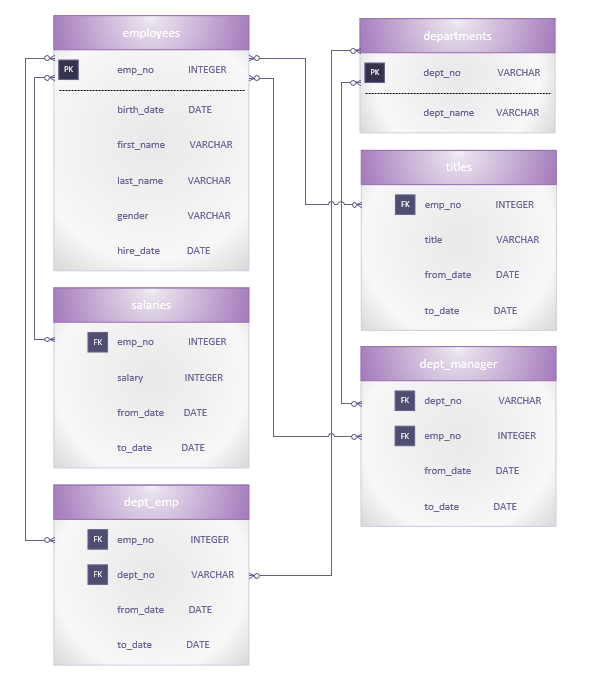

# Analyzing Data With PostgreSQL

Given several CSV files relating to:
* Employees
* Departments
* Salaries
* Job Titles
* Department Managers
* Department Employees

## Data Modeling & Company Entity Relationship Diagram
After evaluating each CSV for data and column headings, the Entity Relationship Diagram was created to show how the data in the CSVs relate to one another. Here we looked at entities, the primary and foreign keys, and the attributes that belong to those entities. 

## Data Engineering
After creating the ERD, we created the database schema including the tables with the required primary and foreign keys and other attributes that belong to the tables. Then the data in the CSVs were imported into their respective tables. But here are some specifics that were considered when assigning data types and constraints on the entity attributes:

* The employees - The "Employee No" attribute which has been assigned as the primary key as they were unique INTEGERS and been assigned as an INTEGER data type. The other attributes but "Hire Date" were assigned as VARCHARS and all but "Gender" has a NOT NULL constraint. The "Hire Date" is a DATE data type.

* The departments - The "Department No" is a VARCHAR data type as it begins with a "d" and therefore cannot be an INTEGER. This is also set as the primary key as the values in the column were all unique. The "Department Name" attribute is set to a VARCHAR data type as it gives us the string values of the department names and the value has been set to NOT NULL as we will need the name of the actual department.

* The salaries - The "Employee No" attribute has been set as the foreign key referenced from the "Employees" table. The salaries table has been set to to an INTEGER data type as every value in the column had no floating point values. The value has been set to NOT NULL as we need the information of every employee working at the company. Lastly, there are the "From Date" and "To Date" attributes are set to DATE data types and they have been set to NOT NULL as we will need this information on the timeframe in which an employee made a certain salary.

* The titles - The "Employee No" attribute is the foreign key referencing the "Employee No" key in the "Employees" table. Then there is a "Title" attribute which is a VARCHAR data type and is set to NOT NULL as we will need the "Title" of the employees working at the company. Lastly, we have the "From Date" and "To Date" attributes which are set to DATE data types and they are set to NOT NULL as it is information that needs to be known.

* The dept_emp - The "Department No" attribute is the foreign key referencing the "Departments" table and the "Employee No" attribute is the foreign key that references the "Employees" table. The "From Date" and "To Date" attributes are DATE data types and are set to NOT NULL as a company will need to know the dates an employee spent at a particular department at the company.

* The dept_manager - The "Department No" attribute is the foreign key referencing the "Departments" table and the "Employee No" attribute is the foreign key that references the "Employees" table. The "From Date" and "To Date" attributes are DATE data types and are set to NOT NULL as a company will need to know the dates an employee spent as the manager at a particular department at the company.

## Data Analysis
Using the information in the tables, queries were created to obtain the requested information from the tables.

